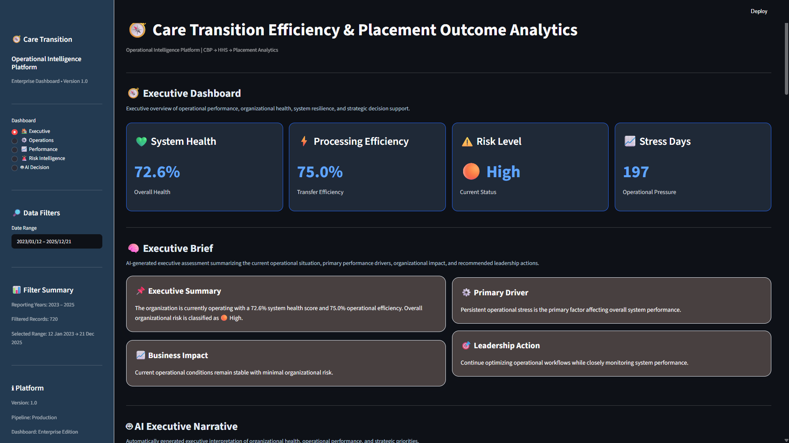
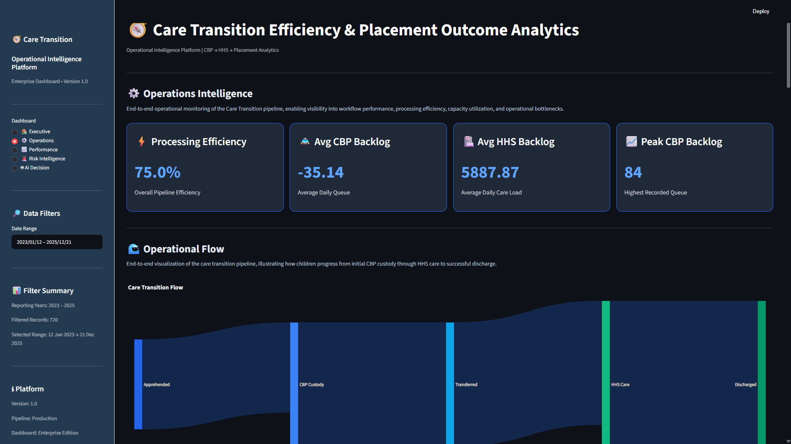
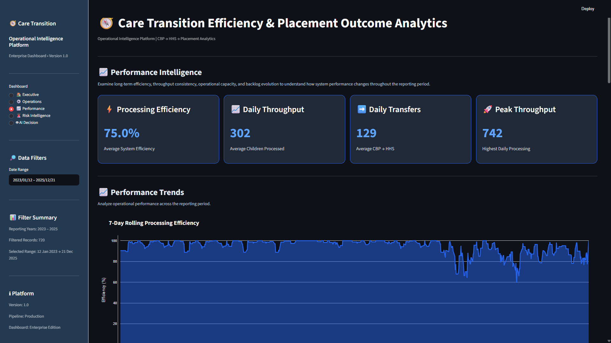
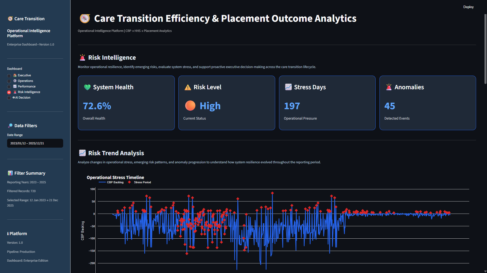
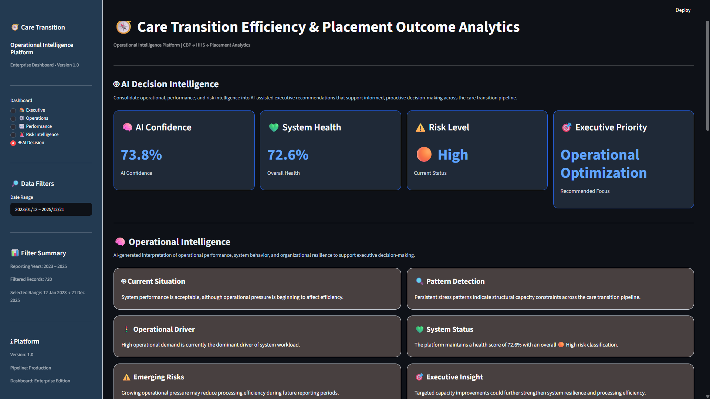

# 🧭 Care Transition Operational Intelligence Platform

### Care Transition Efficiency & Placement Outcome Analytics

An enterprise-grade operational intelligence dashboard designed to analyze historical care transition performance across the **U.S. Department of Health and Human Services (HHS) Unaccompanied Children Program**. The platform transforms raw operational data into executive-level insights through interactive dashboards, operational KPIs, risk analytics, anomaly detection, and AI-assisted decision intelligence.

---


---

# 📸 Dashboard Preview

### Executive Dashboard



---

### Operations Dashboard



---

### Performance Dashboard



---

### Risk Dashboard



---

### AI Decision Dashboard



---

## 📖 Project Overview

The **Care Transition Operational Intelligence Platform** is an end-to-end business intelligence solution built to evaluate the operational efficiency of the care transition pipeline for unaccompanied children.

Rather than relying on static reports, the platform provides an interactive executive dashboard that enables users to monitor system health, operational workload, organizational risk, processing efficiency, backlog trends, and AI-generated strategic recommendations through a modern analytics interface.

The dashboard follows a modular enterprise architecture, separating business logic, analytics, visualization, and presentation layers to improve scalability, maintainability, and future extensibility.

---

# 🎯 Project Objectives

The primary objectives of this project are to:

- Monitor operational performance across the care transition pipeline.
- Measure organizational health using historical operational data.
- Detect operational bottlenecks and anomalies.
- Provide executive-ready dashboards for decision support.
- Demonstrate enterprise dashboard architecture using Python and Streamlit.

---

## ✨ Key Highlights

- 📊 Executive Intelligence Dashboard
- ⚙️ Operations Performance Analytics
- 📈 Historical Trend Analysis
- 🚨 Intelligent Risk Monitoring
- 🤖 AI Decision Intelligence
- 📦 Backlog & Throughput Monitoring
- 📉 Operational Stress Detection
- 🔍 Automated Anomaly Detection
- 💚 System Health Score
- 🎯 Executive Recommendations
- 📑 Dynamic Executive Narratives
- 📱 Interactive Streamlit Dashboard
- 📈 Plotly Visual Analytics
- 🧩 Modular Enterprise Architecture

---

# 🏗️ Project Architecture

The Care Transition Operational Intelligence Platform follows a layered architecture that separates data processing, business logic, analytics, visualization, and presentation into independent modules. This modular design improves maintainability, scalability, code reusability, and simplifies future enhancements.

```text
                     ┌──────────────────────────────────────┐
                     │       HHS Operational Dataset        │
                     │ (Historical Care Transition Records) │
                     └──────────────────────────────────────┘
                                      │
                                      ▼
                     ┌──────────────────────────────────┐
                     │        Data Processing Layer     │
                     │                                  │
                     │ • Data Loader                    │
                     │ • Data Cleaner                   │
                     │ • KPI Engine                     │
                     │ • Stress Engine                  │
                     └──────────────────────────────────┘
                                      │
                                      ▼
                  ┌─────────────────────────────────────────┐
                  │        Analytics & Intelligence Layer   │
                  │                                         │
                  │ • Executive Analytics                   │
                  │ • Operations Analytics                  │
                  │ • Performance Analytics                 │
                  │ • Risk Analytics                        │
                  │ • AI Decision Intelligence              │
                  └─────────────────────────────────────────┘
                                      │
                                      ▼
                  ┌─────────────────────────────────────────┐
                  │         Business Logic Layer            │
                  │                                         │
                  │ • Rules Engine                          │
                  │ • Narrative Engine                      │
                  │ • Recommendation Engine                 │
                  │ • Executive Summary Engine              │
                  │ • Performance Metrics Engine            │
                  └─────────────────────────────────────────┘
                                      │
                                      ▼
                  ┌─────────────────────────────────────────┐
                  │      Visualization Components           │
                  │                                         │
                  │ • KPI Cards                             │
                  │ • Interactive Charts                    │
                  │ • Gauges                                │
                  │ • Heatmaps                              │
                  │ • Sankey Diagrams                       │
                  └─────────────────────────────────────────┘
                                      │
                                      ▼
                  ┌─────────────────────────────────────────┐
                  │          Streamlit Dashboard            │
                  │                                         │
                  │ • Executive Dashboard                   │
                  │ • Operations Dashboard                  │
                  │ • Performance Dashboard                 │
                  │ • Risk Intelligence Dashboard           │
                  │ • AI Decision Dashboard                 │
                  └─────────────────────────────────────────┘
```

---

## 🧩 Architecture Principles

The project was developed using a modular enterprise architecture with clearly separated responsibilities.

| Layer | Responsibility |
|--------|----------------|
| Data Processing | Cleans, validates, and prepares raw operational data |
| Analytics | Calculates KPIs, trends, anomalies, and organizational insights |
| Business Logic | Generates executive summaries, recommendations, and AI narratives |
| Visualization | Builds reusable interactive charts and KPI components |
| Dashboard | Presents executive intelligence through Streamlit modules |

---

## 🚀 Design Goals

- Modular and reusable architecture
- Separation of business logic and UI
- Enterprise dashboard design
- Easy maintenance and future expansion
- Historical operational analytics
- AI-assisted executive decision support


# 📂 Project Structure

```text
Care-Transition-Operational-Intelligence-Platform/
│
├── analytics.py                     # Central analytics orchestration
├── pipeline.py                      # Data processing pipeline
├── run_pipeline.py                  # Pipeline execution script
│
├── data/
│   └── raw/
│       └── HHS_Unaccompanied_Alien_Children_Program.csv
│
├── dashboard/
│   │
│   ├── app.py                       # Streamlit application entry point
│   │
│   ├── assets/
│   │   └── design_system.css
│   │
│   ├── components/
│   │   ├── header.py
│   │   ├── sidebar.py
│   │   ├── executive.py
│   │   ├── operations.py
│   │   ├── performance.py
│   │   ├── risk.py
│   │   ├── ai_decision.py
│   │   └── helpers.py
│   │
│   └── visuals/
│       ├── cards.py
│       ├── charts.py
│       ├── gauges.py
│       ├── heatmaps.py
│       └── sankey.py
│
├── utils/
│   ├── data_loader.py
│   ├── data_cleaner.py
│   ├── kpi_engine.py
│   ├── stress_engine.py
│   ├── anomaly_engine.py
│   ├── metrics_engine.py
│   ├── operations_engine.py
│   ├── performance_engine.py
│   ├── risk_engine.py
│   ├── executive_engine.py
│   ├── executive_kpi_engine.py
│   ├── executive_summary_engine.py
│   ├── narrative_engine.py
│   ├── insight_engine.py
│   ├── insight_generator.py
│   ├── insight_formatter.py
│   ├── performance_metrics_engine.py
│   ├── rules_engine.py
│   └── ai_decision_engine.py
│
├── assets/
│   └── screenshots/
│
├── README.md
└── requirements.txt
```

---

## 📁 Directory Overview

| Directory | Purpose |
|-----------|----------|
| **data/** | Stores the historical HHS operational dataset used for analysis. |
| **dashboard/** | Streamlit user interface, reusable dashboard components, CSS styling, and visualization modules. |
| **utils/** | Core business logic including analytics engines, KPI calculations, anomaly detection, executive summaries, AI decision intelligence, and reusable utilities. |
| **assets/** | Project resources such as dashboard screenshots for documentation. |
| **analytics.py** | Central orchestration layer that coordinates all analytics modules before passing results to the dashboard. |
| **pipeline.py** | Executes the complete ETL and KPI generation workflow. |
| **run_pipeline.py** | Standalone script for rebuilding processed analytics data. |

---

## 🏛️ Modular Design Philosophy

The project is intentionally organized into independent modules to improve:

- 🔹 Scalability
- 🔹 Maintainability
- 🔹 Code Reusability
- 🔹 Separation of Concerns
- 🔹 Enterprise Readability
- 🔹 Future Feature Expansion

This architecture allows each analytics engine, visualization component, and dashboard module to evolve independently while maintaining a clean and extensible codebase.

# ⚙️ Platform Features

The Care Transition Operational Intelligence Platform combines operational analytics, executive reporting, risk intelligence, and AI-assisted decision support into a single interactive dashboard.

---

## 🧭 Executive Intelligence

Designed for leadership teams to monitor organizational performance and make informed strategic decisions.

- Executive KPI Dashboard
- Organizational Health Score
- Executive Brief & Strategic Summary
- Executive Health Assessment
- Dynamic Executive Narratives
- Operational Alerts
- Strategic Recommendations
- Historical Trend Analysis

---

## ⚙️ Operations Analytics

Provides operational visibility across the complete care transition workflow.

- Daily Processing Volume
- Operational Backlog Monitoring
- Processing Efficiency Analysis
- Care Transition Flow Analysis
- Workload Distribution
- Capacity Monitoring
- Interactive Operational Charts

---

## 📈 Performance Analytics

Measures operational effectiveness using historical performance indicators.

- Performance KPI Dashboard
- Historical Throughput Analysis
- Efficiency Monitoring
- Daily Performance Trends
- Operational Benchmarking
- Productivity Analysis
- Performance Distribution

---

## 🚨 Risk Intelligence

Continuously evaluates organizational stability and identifies emerging operational risks.

- Automated Anomaly Detection
- Operational Stress Analysis
- Risk Classification
- Risk Heatmaps
- System Resilience Assessment
- Early Warning Indicators
- Intelligent Alert Generation

---

## 🤖 AI Decision Intelligence

Transforms operational metrics into executive-ready intelligence for decision support.

- AI Operational Summary
- Predictive Intelligence
- Decision Simulation
- Executive Recommendations
- AI Executive Summary
- Dynamic Executive Narratives
- Executive Priority Identification

## 📊 Dashboard Modules

| Dashboard | Purpose |
|-----------|---------|
| Executive | Executive KPIs and organizational overview |
| Operations | Processing efficiency and workflow monitoring |
| Performance | Historical operational performance analysis |
| Risk | Operational risk intelligence and anomaly detection |
| AI Decision | Executive recommendations and scenario simulation |

---

## 📊 Interactive Visualizations

Enterprise-quality visual analytics designed for executive reporting.

- Interactive Plotly Charts
- KPI Cards
- Health Gauges
- Heatmaps
- Sankey Flow Diagrams
- Trend Visualizations
- Executive Information Cards

---

## 🎛️ Interactive Dashboard Experience

The platform provides a responsive and interactive user experience through Streamlit.

- Date Range Filtering
- Sidebar Controls
- Interactive Navigation
- Responsive Layout
- Professional Design System
- Modular Dashboard Components

---

## 🏗️ Engineering Features

Built using modern software engineering practices for scalability and maintainability.

- Modular Architecture
- Reusable Analytics Engines
- Separation of Business Logic & UI
- Central Analytics Pipeline
- Reusable Visualization Components
- Enterprise Folder Structure
- Easily Extensible Design

# 🛠️ Technology Stack

The platform was developed using a modern Python analytics ecosystem, combining data engineering, business intelligence, interactive visualization, and AI-assisted decision support.

| Category | Technologies |
|----------|--------------|
| **Programming Language** | Python 3.13 |
| **Data Processing** | Pandas, NumPy |
| **Interactive Dashboard** | Streamlit |
| **Data Visualization** | Plotly |
| **Statistical Analysis** | Pandas Analytics |
| **AI Decision Support** | Rule-Based AI Intelligence Engine |
| **Data Pipeline** | Custom ETL Pipeline |
| **Architecture** | Modular Layered Architecture |
| **Styling** | Custom CSS Design System |
| **Development Environment** | Visual Studio Code |
| **Version Control** | Git & GitHub |

---

## 📂 Dataset Summary

| Attribute | Value |
|-----------|-------|
| Source | HHS Unaccompanied Children Program |
| Records | 1,170 |
| Features | 6 Original + Engineered KPIs |
| Time Span | Historical Operational Records |

---

## 📦 Core Python Libraries

```python
streamlit
pandas
numpy
plotly
```

---

## 🏛️ Development Principles

The platform was developed following modern software engineering practices, including:

- Modular Architecture
- Separation of Concerns
- Reusable Components
- Analytics-Driven Design
- Interactive Business Intelligence
- Executive-Oriented Reporting
- AI-Assisted Decision Support
- Maintainable Codebase

# 🚀 Installation & Usage

Follow the steps below to set up and launch the Care Transition Operational Intelligence Platform on your local machine.

---

## 1️⃣ Clone the Repository

```bash
git clone https://github.com/Mkarti/Care-Transition-Operational-Intelligence-Platform.git

cd Care-Transition-Operational-Intelligence-Platform
```

---

## 2️⃣ Create a Virtual Environment (Recommended)

### Windows

```bash
python -m venv venv

venv\Scripts\activate
```

### macOS / Linux

```bash
python3 -m venv venv

source venv/bin/activate
```

---

## 3️⃣ Install Dependencies

```bash
pip install -r requirements.txt
```

---

## 4️⃣ Launch the Dashboard

```bash
streamlit run dashboard/app.py
```

---

## 5️⃣ Open in Browser

Streamlit will automatically launch the application.

If it doesn't, open:

```
http://localhost:8501
```

---

# 📂 Dataset

Place the dataset inside:

```
data/raw/
```

Dataset used in this project:

```
HHS_Unaccompanied_Alien_Children_Program.csv
```

---

# 🧠 Project Workflow

```
Raw Dataset
      │
      ▼
Data Loader
      │
      ▼
Data Cleaning
      │
      ▼
KPI Engineering
      │
      ▼
Stress Detection
      │
      ▼
Analytics Engine
      │
      ▼
Executive Intelligence
Operations Analytics
Performance Analytics
Risk Intelligence
AI Decision Intelligence
      │
      ▼
Interactive Streamlit Dashboard
```

---

# ▶️ Running the Analytics Pipeline

To execute the complete analytics pipeline independently of the dashboard:

```bash
python run_pipeline.py
```

---

# 📊 Launch Dashboard

```bash
streamlit run dashboard/app.py
```

---

# 💼 Business Impact

The platform enables organizations to:

✅ Detect operational bottlenecks earlier

✅ Improve resource planning decisions

✅ Monitor organizational health in real time

✅ Reduce executive reporting effort

✅ Support evidence-based decision making

✅ Improve operational transparency

✅ Strengthen strategic planning

✅ Enhance historical operational analysis

---

# 🎯 Intended Audience

This dashboard is designed for:

- Executive Leadership
- Program Directors
- Operational Managers
- Government Decision Makers
- Policy Analysts
- Business Intelligence Teams
- Data Analysts
- Operations Strategy Teams

---

# 🌟 Project Highlights

✔ Fully Interactive Streamlit Dashboard

✔ Historical Operational Intelligence

✔ Executive Decision Support System

✔ AI-Assisted Business Insights

✔ Risk Monitoring Framework

✔ Modular Analytics Architecture

✔ Professional Business Intelligence Design

✔ Production-Ready Dashboard Experience

# 🚀 Future Enhancements

Although the current platform provides a comprehensive historical operational intelligence solution, several enhancements are planned for future releases.

---

## Version 2.0

### 🤖 Machine Learning Forecasting

- Forecast future operational workload
- Predict CBP backlog growth
- Estimate HHS placement demand
- Forecast System Health Score
- Early warning prediction models

---

### 📡 Real-Time Operational Monitoring

- Live dashboard updates
- Streaming operational metrics
- Real-time anomaly detection
- Continuous executive alerts
- Live KPI refresh

---

### 🧠 Advanced AI Intelligence

- Large Language Model (LLM) powered executive summaries
- Natural language dashboard queries
- AI-powered operational recommendations
- Intelligent report generation
- Conversational analytics assistant

---

### 📈 Advanced Predictive Analytics

- Capacity demand forecasting
- Resource optimization models
- Operational scenario planning
- What-if simulation engine
- Strategic planning support

---

### 🌎 Geographic Intelligence

- Interactive geographic dashboards
- Regional operational comparisons
- Heatmap visualization
- Location-based risk monitoring
- Capacity distribution analysis

---

### 📊 Enhanced Business Intelligence

- Custom executive reporting
- PDF report generation
- Automated scheduled reports
- KPI benchmarking
- Cross-agency comparisons

---

### 🔐 Enterprise Features

- User authentication
- Role-based dashboard access
- Audit logging
- Secure data integration
- API connectivity

---

## Long-Term Vision

The long-term objective is to evolve this platform into a comprehensive **Operational Decision Intelligence System** capable of combining historical analytics, predictive modeling, artificial intelligence, and real-time monitoring to support strategic decision-making across large-scale care transition operations.

# 📜 License

This project is released under the **MIT License**.

You are welcome to use, modify, and distribute this project for educational, research, and non-commercial purposes.

See the LICENSE file for additional details.

---

# 🙏 Acknowledgements

This project was developed as part of the **Unified Mentor Internship Program**.

Special thanks to:

- Unified Mentor Internship Program
- U.S. Department of Health & Human Services (HHS)
- Office of Refugee Resettlement (ORR)
- Streamlit Community
- Plotly
- The Python Open Source Community

whose tools, datasets, and resources made this project possible.

---

# 👨‍💻 Author

**Kartikeya Mishra**

Machine Learning Engineer | Data Analyst | Business Intelligence Developer

### Areas of Interest

- Machine Learning
- Data Analytics
- Business Intelligence
- Data Visualization
- Artificial Intelligence
- Operational Analytics

---

## 🌐 Connect With Me

**LinkedIn**

www.linkedin.com/in/kartikeya-mishra-13krs03

**GitHub**

https://github.com/Mkarti

---

# ⭐ Support

If you found this project helpful or interesting, consider giving it a ⭐ on GitHub.

Your support helps motivate future improvements and the development of additional open-source analytics projects.

---

# 🚀 Final Note

The **Care Transition Operational Intelligence Platform** demonstrates how historical operational data can be transformed into meaningful executive intelligence through modern analytics, interactive visualization, and AI-assisted decision support.

Rather than simply presenting historical metrics, the platform provides actionable insights that support strategic planning, operational transparency, and evidence-based decision-making.

This project reflects the integration of data engineering, business intelligence, software engineering, and executive analytics into a unified decision-support platform.